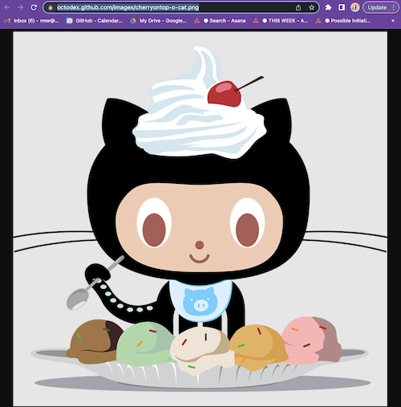

- [Markdown resources](#markdown-resources)
- [Markdown headers](#markdown-headers)
- [Markdown Images](#markdown-images)
 ⬅️ [**Back to Contribute**](2-contribute.md)

## Markdown resources

- [Quickstart guide to writing on GitHub](https://docs.github.com/en/get-started/writing-on-github/getting-started-with-writing-and-formatting-on-github/quickstart-for-writing-on-github)
- [Basic writing and formatting syntax](https://docs.github.com/en/get-started/writing-on-github/getting-started-with-writing-and-formatting-on-github/basic-writing-and-formatting-syntax)
- [Markdown Guide](https://www.markdownguide.org/getting-started/)
- [Markdown All In One documentation](https://markdown-all-in-one.github.io/docs/guide/#features)

## Markdown headers

In the [last section](2-contribute.md), we created a markdown file and added a [header](https://docs.github.com/en/get-started/writing-on-github/getting-started-with-writing-and-formatting-on-github/basic-writing-and-formatting-syntax#headings).

How, you ask? 

We added `#` in front of text.

The more `#` we add in a row, the smaller the header size. So `##` is smaller than `#`.

Let's add a secondary header to our markdown file. Below your first title, type:

```
## My favorite Octocat
```

## Markdown Images

Who doesn't love Ocotcats? Let's find out favorite.

- Got to the [octodex](https://octodex.github.com/)
- Find your favorite Octocat
- Right-click on the image
- Select "Open image in new tab"
<br />
- Copy the URL of the new tab that was opened
<br />

Now below the header we just added, let's add an image. Replace the URL with the one you just copied.

```
## My favorite Octocat


```
